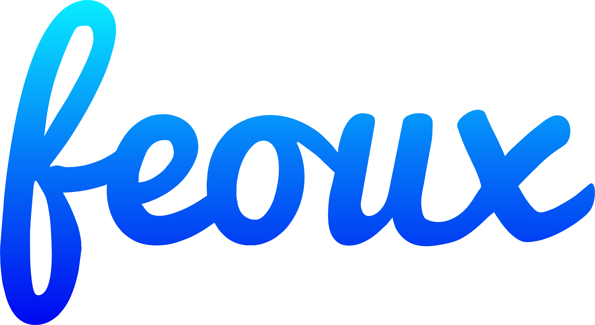

# Feoux - Content Sharing Platform (Discontinued)



Feoux was article sharing platform launched in 2017 where anyone can read and publish articles all around globe. But now its completely discontinued. Feoux.com domain is now trademark™ of feoux - IT solution company located in Punjab. Me as Developer of this platform want to share code with others so this dream could never stop. Anyone can use code and restart this platform by new name and new system. I will never mind. Enjoy haveing details of WebApp

**Feoux** was an article sharing platform that made its debut in 2017, allowing users from across the globe to read and publish articles. However, as time passed, Feoux ceased its operations and is now a part of the trademark™ portfolio of **Feoux - IT Solutions**, a company based in Punjab.

As the original developer of Feoux, I believe in keeping dreams alive. Therefore, I’m sharing the codebase with the world. If you’re passionate about content sharing platforms and wish to breathe new life into this concept, feel free to use the code. Whether you choose to revive it under a different name or reimagine it with a fresh approach, I wholeheartedly support your endeavor.

**Please note that the Feoux app was discontinued in 2022.** Despite its closure, let’s ensure that the spirit of Feoux lives on, inspiring new communities and fostering the exchange of ideas. 🚀📝

Let’s ensure that the spirit of Feoux lives on, inspiring new communities and fostering the exchange of ideas. 🚀📝

---

Feel free to customize and expand upon this introduction in your README.md. Best of luck with your project! 😊


# Features


Feoux.com, similar to other content sharing platforms, aims to provide a space for creators to share their work and engage with an audience. Here are some features that Feoux.com could incorporate:

1. **User Profiles and Authentication**:
   * Users can create personalized profiles with avatars, bios, and social links.
   * Secure authentication mechanisms (e.g., email, social logins) protect user accounts.
2. **Content Creation and Publishing**:
   * Creators can publish various types of content: articles, blog posts, images, videos, etc.
   * User-friendly editor with formatting options.
   * Support for scheduled publishing and draft saving.
3. **Content Discovery and Curation**:
   * Robust search functionality for users to discover relevant content.
   * Ability to follow specific topics, tags, or other users.
   * Curated content based on user preferences.
4. **Social Interaction and Engagement**:
   * Like, comment, and share features for content.
   * Notification system for interactions (new comments, likes).
   * Threaded comments for discussions.
5. **Content Moderation and Reporting**:
   * Tools to manage inappropriate or spammy content.
   * User reporting for violations (e.g., hate speech, plagiarism).
6. **Analytics and Insights**:
   * Content creators receive analytics on views, engagement, and audience demographics.
   * Optimization recommendations based on performance.
7. **Monetization Options**:
   * Revenue-sharing models for content creators (ads, sponsorships, subscriptions).
8. **Integration with Social Media**:
   * Cross-posting content to external platforms (e.g., Twitter, LinkedIn).
9. **Customization and Theming**:
   * Personalized profile pages and content layouts.
   * Themes or templates for consistent branding.
10. **Collaboration Features**:
    * Support for collaborative content creation (co-authoring, shared drafts).
11. **Mobile App and Responsive Design**:
    * Mobile app for on-the-go content management.
    * Responsive design across devices.
12. **SEO Optimization**:
    * Tools to optimize content for search engines.


# To - Do's for Enhancing Feoux


* **Modern Theme Enhancement**:

  * Revamp the user interface with a **modern, sleek theme**. Consider using popular design frameworks like Bootstrap or Tailwind CSS.
  * Prioritize readability, responsiveness, and aesthetics.
* **Performance Optimization**:

  * **Speed matters!** Optimize your platform for faster loading times.
  * Minimize HTTP requests, compress assets, and leverage browser caching.
  * Consider using a Content Delivery Network (CDN) for efficient content delivery.
* **Video Rendering from Own Videos**:

  * Implement a robust video rendering system that allows users to upload and share their own videos.
  * Support common video formats (e.g., MP4, WebM).
  * Ensure compatibility across browsers and devices.
* **Adaptive Bitrate Framing**:

  * Enable **adaptive streaming** for videos. This ensures smooth playback by adjusting quality based on the user’s internet connection.
  * Implement technologies like **HLS (HTTP Live Streaming)** or **DASH (Dynamic Adaptive Streaming over HTTP)**.
  * Provide multiple quality options (bitrates) for seamless viewing.
* **User-Uploaded Videos**:

  * Allow users with publisher privileges to upload their own videos.
  * Implement secure storage and access controls for user-generated content.
* **Documentation and Setup Guide**:

  * Create a comprehensive README.md that guides contributors and users.
  * Include installation instructions, environment setup, and deployment steps.
  * Explain how to configure video rendering settings.
* **Testing and Quality Assurance**:

  * Rigorously test your platform across different browsers, devices, and network conditions.
  * Address any bugs, glitches, or performance bottlenecks.
  * Consider automated testing (unit tests, integration tests).
* **Community Engagement**:

  * Foster a community around Feoux.
  * Encourage feedback, feature requests, and contributions.
  * Set up a discussion forum or chat for users and developers.
* **Monetization Strategies (Optional)**:

  * Explore ways to monetize the platform (ads, premium features, subscriptions).
  * Balance revenue generation with user experience.
* **Legal and Privacy Considerations**:

  * Include terms of use, privacy policy, and copyright information.
  * Ensure compliance with data protection laws.
* **Continuous Improvement**:

  * Regularly update and maintain Feoux.
  * Listen to user feedback and iterate on features.
* Complete AI Integration

Remember, Feoux’s revival is a collaborative effort. Let’s build a platform that inspires content creators and readers alike! 🚀📝


# References

Certainly! When building our content sharing platform, we drew inspiration from several open-source tools and libraries. Here are the references we used:

1. **VvvebJs**:
   * VvvebJs is a **drag-and-drop website builder JavaScript library**. It allows users to create web pages visually by assembling components.
   * [GitHub Repository: ](https://github.com/givanz/VvvebJs)[VvvebJs](https://github.com/givanz/VvvebJs)[^1^](https://github.com/givanz/VvvebJs).
2. **GrapesJS**:
   * GrapesJS is a **free and open-source web builder framework**. It enables the creation of HTML templates without coding.
   * It supports HTML video, audio, YouTube, and Vimeo, making it versatile for various media types.
   * [GitHub Repository: ](https://github.com/givanz/VvvebJs)[GrapesJS](https://github.com/GrapesJS/grapesjs)[^2^](https://github.com/sampotts/plyr).
3. **Gramateria**:
   * Gramateria is another **drag-and-drop web builder** built with GrapesJS. It offers a different look, blocks, and components.
   * Version 1.0.6 uses **Bootstrap 5**, can generate a desktop app with **ElectronJS**, and supports deployment to **Netlify**.
   * [GitHub Repository: ](https://github.com/givanz/VvvebJs)[Gramateria](https://github.com/ronaldaug/gramateria)[^3^](https://github.com/ronaldaug/gramateria).
4. **Plyr**:
   * Plyr is a **simple, lightweight, and customizable HTML5, YouTube, and Vimeo media player**.
   * It supports modern browsers, provides accessibility features, and allows customization.
   * [GitHub Repository: ](https://github.com/givanz/VvvebJs)[Plyr](https://github.com/sampotts/plyr)[^2^](https://github.com/sampotts/plyr).

Feel free to explore these tools further and adapt their features to enhance our content sharing platform! 🚀📝

# How-To

Explore

Certainly! To install Feoux on an Apache PHP-based server, follow these steps:

1. **Prerequisites**:
   * Ensure you have the following prerequisites:
     * A CentOS 8 server with at least 1GB of RAM.
     * Apache web server installed and configured.
     * PHP versions 7.3 and 7.4 with PHP-FPM (FastCGI Process Manager) installed.
     * MySQL database set up.
     * A domain name pointing to your server (e.g., site1.your\_domain and site2.your\_domain).
     * The database file is located in the `assets` folder.
2. **Install PHP Versions 7.3 and 7.4 with PHP-FPM**:
   * Install the Remi repository to manage multiple PHP versions:
     ```bash
     sudo dnf install https://rpms.remirepo.net/enterprise/remi-release-8.rpm
     ```
   * Enable the EPEL repository (which is also included with the above command).
   * List available PHP versions:
     ```bash
     sudo dnf module list php
     ```
   * Install PHP 7.3 and 7.4:
     ```bash
     sudo dnf module install php:remi-7.3 php:remi-7.4
     ```
3. **Configure Apache**:
   * Set up virtual hosts for your domains (site1.your\_domain and site2.your\_domain).
   * Configure Apache to use PHP-FPM for each domain.
4. **Database Setup**:
   * Create a MySQL database for Feoux.
   * Import the database file from the `assets` folder.
5. **Deploy Feoux**:
   * Upload the Feoux codebase to your server.
   * Configure Feoux to connect to the MySQL database.
   * Update domain-specific settings (e.g., site1.your\_domain and site2.your\_domain).
6. **Test and Secure**:
   * Test Feoux by accessing the domains in your browser.
   * Ensure proper permissions for files and directories.
   * Set up SSL certificates for secure communication (optional but recommended).

Remember to customize Feoux according to your needs, and enjoy sharing content with your users! 🚀📝

# Buy me a cup of coffee

Certainly! Here are the instructions for supporting me by donating using **Indian UPI** and contacting me for foreign donations:


1. **For Indian Users (UPI)**:

   * Contact me on jashannandha04@gmail.com or telegram.
   * I will share you my UPI ID.
   * Pay anything on that.
2. **For Foreign Users**:

   * Contact me on **Telegram** at JashanNandha or jashannandha04@gmail.com.

Thank you for your support! Your contribution makes a difference. 🙏 If you have any further questions, feel free to ask. 😊

## “Thank you for your support and enthusiasm! As you embark on building the feoux-content sharing platform, remember that every line of code you write has the potential to shape the digital landscape. May your platform thrive, connect people, and become a hub for creativity and collaboration. Happy coding, and may your journey be filled with success and innovation!” 🚀🌟
